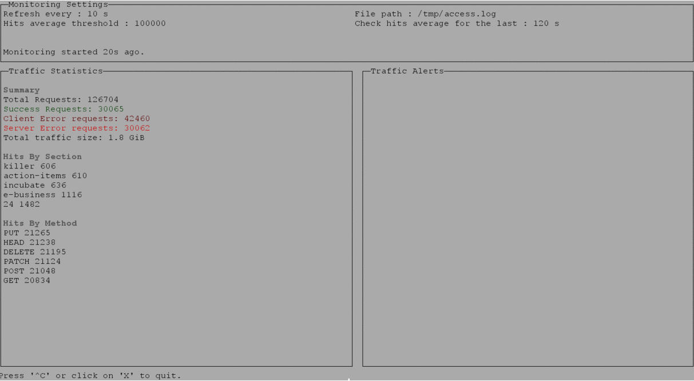

# Http Log Monitor  

HTTP log monitoring console program that consumes   an actively written-to [w3c-formatted HTTP access log].

## Project description  

A console program that monitors HTTP traffic from a log file :  

>- Consumes an actively written-to [w3c-formatted HTTP access log]. It defaults to reading /tmp/access.log and be overrideable.
>- Every 10s, displays in the console the sections of the web site with the most hits (a section is defined as being what's before the second '/' in a URL. i.e. the section for "http://my.site.com/pages/create' is "http://my.site.com/pages"), as well as interesting summary statistics on the traffic as a whole. 
>- The console app can be kept running and monitor traffic on the machine in real time.
>- Whenever total traffic for the past x minutes exceeds a certain number on average, a message saying that “High traffic generated an alert - hits = {value}, triggered at {time}” is displayed.
>- Whenever the total traffic drops again below that value on average for the past 2 minutes, a message detailing when the alert recovered is displayed.
>- All messages showing when alerting thresholds are crossed stay visible on the page for historical reasons.

## Documentation

The Java doc is available [here].  

## Requirements

Java 8 runtime environment.

A docker image can be mounted using this [Dockerfile](Dockerfile).

## Compiling and Running the application

### Run

Run the application using the bash script:

```
./http-monitoring.sh
```

Press ctrl+c to stop the application. 

To display the application help run the scipt with ``` --help ```:
```
./http-monitoring.sh --help
```
This will print the following help menu:
```
usage: ./http-monitoring.sh [-f <arg>] [-r <arg>] [-t <arg>] [-c <arg>]  
    -f,--log-file-path <arg>      The log file absolute path, default /tmp/access.log
    -r,--refresh-frequency <arg>  The reporting refresh frequency in seconds, default 10 
    -t,--hits-threshold <arg>     Hits threshold on average during the monitoring duration, default  100
    -c,--threshold-cycles <arg>   Number of refresh cycles after which traffic threshold must be checked, default 12
```

Example,

```
./http-monitoring.sh -f /var/log/access.log -r 10 -t 100 -c 12
```

This will monitor the file located in ```/var/log/access.log```. The console will refresh every 10 seconds and checks if the traffic hits average during the last 12*10 seconds (2 minutes) has exceeded 100 hits.  

### Tests

To launch the unit test with maven, run:  

```
mvn test
```

### Build  

An executable jar can be generated using Maven :  
Move to the project root directory ```http-log-monitor``` and run  
```maven clean install```.  
A jar file ```http-log-mnitor.jar``` will be generated in ```/target``` subdirectory.  In order to make it visible to the bash script it must be moved to the project root directory:  
Move to ```target``` and run :  
```
cp target/http-log-monitor.jar .
```

### Logs  

A log file called ```logFile.log``` is generated in the root directory.  

## Architecture
The application is splitted into 3 main modules which communicate through a [Guava EventBus].

### File Watcher Module
This module watches the log file for changes and read all the new lines when the file is modified.  
It is based on the [Java WatchService] and reads the new lines only when a change on the file is detected. This avoid reading the file when there are no new logs.  
The log lines are delegated to a Log Parser wich parses them and publishes [CommonLogFormatEntry] events to the bus.  
The parser only recognizes [Common Log Format] logs. Example :  
```127.0.0.1 user-identifier frank [10/Oct/2000:13:55:36 -0700] "GET /apache_pb.gif HTTP/1.0" 200 2326```  
Notice the date format is ```dd/MMM/yyyy:HH:mm:ss Z``` and the request is double quotes limited.

### Traffic Statistics Manager Module
This module consumes the [CommonLogFormatEntry] events, computes and publishes traffic statistics every ```refresh-frequency``` seconds to the the bus.  The published traffic statistics are encapsulated in a [TafficStatistics] event.  

### Alert Manager Module  
This module triggers alerts when the average traffic hits theshold is exceeded or recovered. It consumes the traffic statistics published by the Traffic Statistic Manager Module in order to avoid computing the initial logs again.  
It checks the traffic hits average during the kast ```threshold-cycles * refresh-frequency``` seconds.  When the threshold is exceeded or the traffic is recovered after having exceeded the threshold it published a [TrafficAlert] event to the bus.

### GUI Console
A Console style Graphical User Interface built with the [Lanterna Java Graphical Library].
It consumes both the traffics statistics events published by the traffic statistics module and the traffic alert events published by the alert manager module.  

### Improvements

* The file watcher is based on the WatcherService which avoid performing file read when there are no new logs. This may cause a problem if the log file is kept open by a logger and hence the WatchService doesn't trigger the file modification. It may be a better options to poll the file in some situations. I may add the polling file watcher implementation and let the user choose the reading mode.
* The alerts and statistics may be exposed through a RESTfull API.
* Support more log formats. Either preconfigure different log format or let the user describe the format with a custom regular expression for example.
* Split the modules to separate applications that can be deployed in different independant environments. A File Watcher for example may be thrown in a distant machine and the exposes the logs through a web API.
* The Traffic Alert Manager module depends on the Traffic Statistics module as it consumes the Traffic Statistics. It may be better to make it independant and directly consume the log events. That will gives the user the abality to run the Alert Manager alone if needed.


## License

This software is under the [MIT license].

## Demo  



[here]: <https://mehdi-aouadi.github.io/http-log-monitor/>  
[w3c-formatted HTTP access log]: <https://www.w3.org/Daemon/User/Config/Logging.html>  
[MIT license]: <https://opensource.org/licenses/MIT>  
[Guava EventBus]: <https://github.com/google/guava/wiki/EventBusExplained>
[Java WatchService]: <https://docs.oracle.com/javase/7/docs/api/java/nio/file/WatchService.html>
[CommonLogFormatEntry]: <https://mehdi-aouadi.github.io/http-log-monitor/org/datadog/log/CommonLogFormatEntry.html>
[TafficStatistics]: <https://mehdi-aouadi.github.io/http-log-monitor/org/datadog/statitics/TrafficStatistic.html>
[Lanterna Java Graphical Library]: <https://github.com/mabe02/lanterna>
[TrafficAlert]: <https://mehdi-aouadi.github.io/http-log-monitor/org/datadog/alerts/TrafficAlert.html>
[Common Log Format]: <https://en.wikipedia.org/wiki/Common_Log_Format>